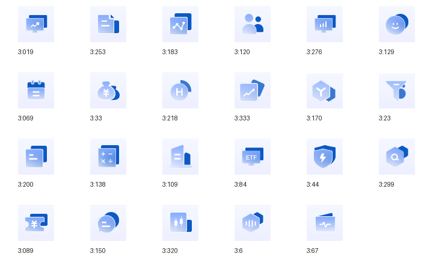

# skillhub金融业务图标

用于 Skill Hub、MCP 与金融业务入口的图标检索和复用 skill，包含 23 枚图标、25 份原始 SVG、原稿预览与使用规范。



## 使用

下载本仓库，将整个目录命名为 `skillhub-financial-business-icons` 并放入个人 skills 目录。调用示例：

> 使用 $skillhub-financial-business-icons，为这个页面匹配已有业务图标。

也可在本地运行：

```sh
python3 scripts/find_icon.py "港股资金面"
```

## 内容

- [SKILL.md](SKILL.md)：技能入口与使用规则。
- [图标目录](references/catalog.md)：名称、业务含义与使用边界。
- `assets/originals/`：原始矢量资源。
- `assets/previews/`：MasterGo 原稿预览。
- `assets/compositions/`：图标组合与浏览器预览包装。
- `catalog.html`：下载后在本地打开的图标对照页。

尺寸为 60×60。部分 SVG 滤镜在浏览器中与 MasterGo 原稿存在差异，详见[视觉与复用规则](references/visual-rules.md)。未收录的业务图标不会自动替代。
